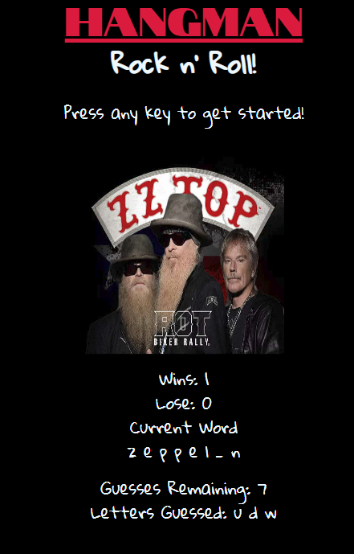

# Hangman

## Overview
The almighty Hangman Game! This is a word guessing game with a theme of Rock n' Roll bands.
- You have 10 tries to guess each letter for the secret word shown.
- For each letter that is guessed correctly, it will display on the corresponding blank spot(s) for that specific word. 
- If you guessed them all correctly, an alert will pop up saying "You Win!", and the image will change to an album cover of the artist.
- If you run out of guesses, then you guessed it, an alert will pop up saying "You Lose!" and the game will reset.
- The game will keep track of your wins and your losses, so have fun and Good Luck!

## Tech Approach
- I began by setting up a basic HTML page. First div is the header and in side is the title, theme, and start instructions. From there I set up my container that held most of the content for the game. I used bootstrap for a basic template container, row, and column.
    - First row contains the image or album cover of the artist.
    - Second row contains the wins, loses, and current word. The current word is displayed with underscores for each letter. Under the word to be guessed is the number of guesses remaining, and which letters have been guessed. 
- **JavaScript**
    - I began by creating all the words that could be guessed. Each word is a string in an array and that array is set to the variable game. I also had a few initial variables which were answer, wordLength, numBlanks, correctGuesses, and usedLetter. I also created the variables to keep score which were wins, lose, attempsLeft.
    - **startGame()** I created a startGame function that chose a random word from the game array by using math.floor and math.random multiplied by the length of the array. The answer returned will be the indicie of the game array which will be the current answer. To create the underscores I took the answer and used the method split("").
    ```javascript
    // example: word
    // returns  ["w","o","r","d"]
    ```
    Now with the word split up, I set the new array equal to the variable numBlanks. I ran a for loop over numBlanks and with the results of the for loop I took my variable correctGuesses and used the method push("_"). 
    ```javascript
        for (let i = 0; i < numBlanks; i++) {
        correctGuesses.push("_");
    }
    ```
    Now that the answer has the correct amount of underscores I dynamically populated the document. From the HTML doc I grabbed the element id "wordToGuess".innerHTML and set it equal to the correctGuesses and used the method join(" ") to eliminate the unecissary comma between the letters for a better look. 
    ```javascript
     document.getElementById("wordToGuess").innerHTML = correctGuesses.join(" ");
    ```
    - **varifyGuess()** The next function varifies that the letter chosen is one of the correctGuesses. Begin by setting variable isLetterInWord to false. Then run two for loops. First for loop loops over the array numBlanks and checks to see if indicie is equal to a letter. The letter is passed through as an argument in the function. If the answer indicie is equal to letter, then isLetterInWord is true.
    ```javascript
    var isLetterInWord = false;
    for (let i = 0; i < numBlanks; i++) {
        if (answer[i] == letter) {
            isLetterInWord = true;
        }
    }
    ``` 
    Now we want to be able to push the letter into the underscore or blank spot. To do so I ran another for loop declaring if isLetterInWord true, then run a for loop over the numBlanks, then the letter is equal to each indicie of the correctGuesses, else then push the letter to the usedLetter array and decrement the amount of attempsLeft.
    ```javascript
        if (isLetterInWord) {
        for (let i = 0; i < numBlanks; i++) {
            if (answer[i] == letter) {
                correctGuesses[i] = letter;
            }
        }
    }
    else {
        usedLetter.push(letter);
        attempsLeft--;
    }
    ```
    - **onkeyup** This is a listener function that listens for the event of a key on the keyboard being pressed or technically released in this case because it's on the key up. When the key is released, we log that event.key by setting it to the variable userGuess. That variable is then passed in to the prior function varifyGuess. Only thing left is to create some logic to determine if the user guessed all the letters in the word or if they are out of guesses. This is a simple if/else statement that will change the score, alert the user, and then run the startGame function.
    ```javascript
    document.onkeyup = function (event) {
    var userGuess = event.key;
    varifyGuess(userGuess);
    if (wordLength.toString() === correctGuesses.toString()) {
        wins++;
        alert("You Win!");
        document.getElementById("wins-text").innerHTML = wins;
        changingImage();
        startGame();
    }
    else if (attempsLeft === 0) {
        lose++;
        alert("You Lose!");
        document.getElementById("losses-text").innerHTML = lose;
        startGame();
    }
  }
    ```
## Challenges
- The challenge to this game was deconstructing an array and rerendering it. Also the process of varifying the guess, and listening for the onkeyup was a challenge but this build is a great was to learn arrays, methods, loops, and function callbacks. 
## Tech Stack
- HTML
- CSS
- Bootstrap
- JavaScript
# Links
https://allen138.github.io/Hangman/